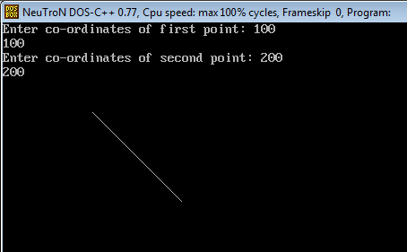
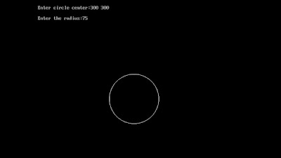
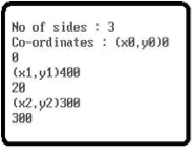
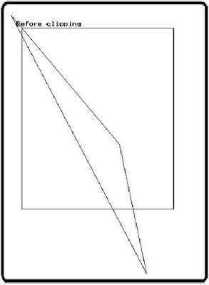
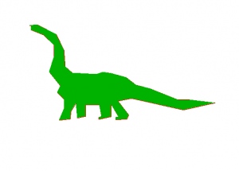

{width="4.7243055555555555in" height="2.93125in"}

{width="6.045976596675415in" height="3.2873567366579177in"}

{width="3.9770833333333333in" height="3.06875in"}

{width="3.0458333333333334in" height="4.1722222222222225in"}

{width="3.126388888888889in" height="2.2416666666666667in"}
